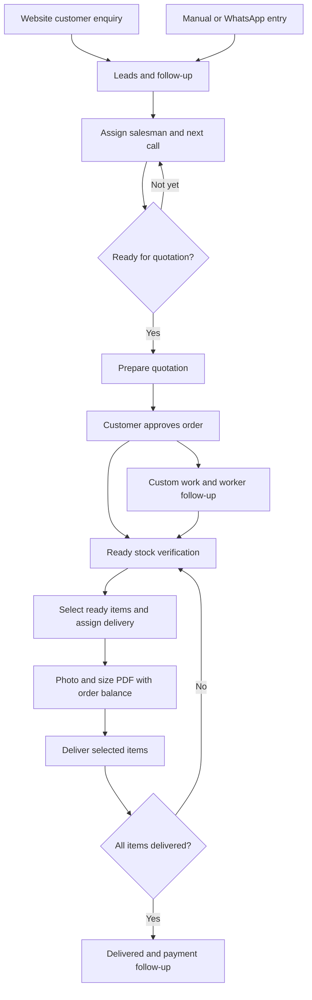

# Leads → quotation → delivery

## Staff workflow

| Page | Responsible person | Action |
| --- | --- | --- |
| Enquiry Inbox | Office / sales | Review incoming website enquiries. Open Leads & Follow-up. |
| Leads & Follow-up | Assigned salesman | Check source and entered-by; add manual/walk-in/WhatsApp leads; record next call or meeting and notes. |
| Leads & Follow-up | Assigned salesman | When the customer agrees to quotation preparation, choose Convert to quotation. This does not confirm the order. |
| Quotation | Sales / pricing | Verify items, photos, size, quantity, price, advance and delivery date. Obtain final customer approval and confirm the order. |
| Ready stock / work orders | Warehouse / production | Route each item separately. For custom work, assign the worker and follow up; verify receipt and readiness. |
| Delivery planner | Delivery coordinator | Dated draft orders may appear for planning. Actual dispatch requires confirmation and ready items. Assign trip and team. |
| Delivery slip | Office / delivery coordinator | Select only the ready items for this delivery. Download PDF or use Share PDF and choose WhatsApp. The displayed outstanding balance is for the entire order. |
| My Trips | Delivery team | Mark only received item rows delivered. Remaining rows stay pending; close the order only when all items are delivered. |

## Source and responsibility

- **Source** answers where the enquiry came from: website, manual, WhatsApp or other.
- **Entered by** identifies the original staff entry, or the customer website form.
- **Follow-up salesman** is the lead owner. It is independent of the person who entered the lead.
- **Quotation created by** identifies the signed-in person who converted the lead. The assigned salesman's name is copied when converting.
- The quotation retains a link to the original lead and its source. A directly created quotation displays “Direct quotation · No linked lead”.
- Missing historical attribution is displayed as “Not recorded”; this release does not guess or backfill people.
- Conversion is locked and idempotent. Lost/cancelled leads must be reopened first.
- Changing lead notes does not update an already-created quotation. Edit commercial details and quotation salesman on the quotation itself.

## Delivery boundaries

Planning visibility is not dispatch permission. A morning delivery can be planned before confirmation, but confirmation and item readiness are required for dispatch. Partial delivery means selected complete item rows; partial quantities within one row must be split before delivery. PDF sharing does not mark items delivered, collect payment, or send WhatsApp messages automatically. Native file sharing availability depends on the device; download and attach the PDF when necessary.

## Validation

- Regression tests for source and missing attribution.
- Transactional database test in `supabase/tests/lead_provenance.sql` runs as authenticated staff, verifies website/manual conversion, creator, salesman, retry behavior and lost-lead handling; all fixtures roll back.
- Production build; existing delivery-planning tests retained.
