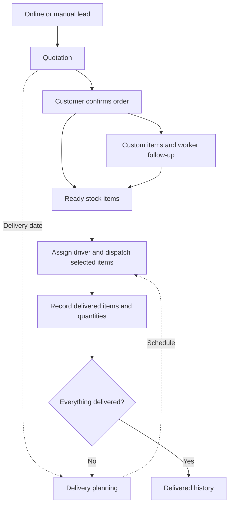

# Lead to delivery: workflow and audit, 28 September 2026

## Intended operating model

Online/manual/WhatsApp leads stay in Leads until the customer agrees to proceed. Preserve the lead source and linked quotation when converted. Distinguish this conversion from commercial order confirmation: the current conversion RPC creates a draft quotation, not a confirmed order.

A quotation can contain both ready-stock and custom items. Route each item independently. Ready-stock items need stock verification/allocation; custom items need a worker, due date, follow-up, completion and warehouse acceptance. Customer confirmation, readiness and delivery date are separate facts.

Planning includes dated unconfirmed quotations with an explicit confirmation-pending label. Scheduling does not authorize dispatch. Same-day confirmed orders should not require another confirmation merely to appear on today's list. Delivery dates must remain visible when production is late.

Example: 10 items, 3 ready and 7 custom. Delivering the first 3 leaves the quotation open with 7 pending. Only final delivery removes it from Active and places it in Delivered history. Outstanding payment and installation remain separate follow-ups; delivery must not erase them.

## Evidence checked

- Repository baseline: 0500011 on main.
- Connected database matched the project in the repository configuration.
- Read-only aggregate query found 10 nondeleted, nonrejected, nondelivered customer quotations with delivery dates excluded by the old planner confirmation/stage predicate. There was 1 pending customer quotation dated today; this does not prove that today's one was among the 10.
- AdminDeliveryPlanner excluded dated drafts and inferred whole-order completion from trip completion.
- warehouse_order_items supports ready-stock/custom readiness, while warehouse dispatch uses confirmed orders and ready item rows.
- confirm_quotation_to_order exists and logs item conversion events; converting a lead alone produces quote_preparation, stage 2.
- trip_quotations_mark_delivered currently stamps ALL remaining quotation items delivered and closes the whole quotation. It has no selected-item/quantity scope.
- AdminLogistics also infers completion from a delivered trip; its active-trip states omit in_transit.

## Changes in this patch

Delivery planner now includes dated quotations before confirmation, labels unconfirmed entries, excludes purchase orders/cancelled records/legacy unconverted website enquiries, refreshes each minute and on window focus, uses the Indian business date and reports query failures. Completion uses item delivery evidence instead of trip completion, with explicit status fallback for legacy records without items.

## Still required before claiming the complete workflow is fixed

1. Item/quantity-scoped trip manifests and delivery recording, including retries and partial receipt. Replace the blanket trip completion database trigger only alongside all affected callers and transaction tests. The planner patch cannot recover items already falsely stamped delivered by that trigger.
2. Apply the same completion rule to route planning, quotation Active/Delivered lists and dashboard counts. Reconcile status mismatches using verified delivery evidence, never guessed data.
3. Decide and implement whether confirming a lead also confirms the commercial order. Avoid duplicate confirmation steps while retaining the distinction between an estimate and an accepted order.
4. Verify stock reservation, worker due dates, warehouse acceptance, delivery assignment and installation/payment follow-up in an authenticated end-to-end test.
5. Confirm deployment of this patch and exercise same-day, mixed-stock, partial-delivery, cancellation and midnight scenarios in the live UI.

No production customer data or database functions were modified by this audit.

## Follow-up implemented, 28 September 2026

- Trip stops now record explicit delivered item IDs in one database transaction. The driver page has an unchecked-by-default received-item selection and no longer writes every quotation item or attempts to update the warehouse view.
- The database checks caller ownership/role, confirmed order, item membership, readiness and duplicate/replayed updates. A completed stop is immutable. The function is private and cannot be executed directly by anonymous/authenticated API callers.
- A completed trip no longer hides remaining quotation items from route planning. Orders with some ready items can be scheduled, and a completed/cancelled trip does not permanently reserve a quotation.
- The final-item notification was using stage 7 although both tables accept only stages 1–6. Delivery remains in stage 6; the completion status carries Delivered.
- Transactional regression tests passed with rollback: blanket update blocked, unrelated item blocked, unfinished custom item blocked, unauthorized caller blocked, partial delivery preserves remaining items, identical retry preserves timestamp, final delivery closes the quotation/trip.
- Limitation: selection records a whole quotation item row (all its displayed quantity). Splitting one row's quantity across receipts requires quantity-level delivery accounting; partially ordered/cancelled rows are blocked with an explanation. Historical incorrect delivery stamps are not inferred or rewritten.
